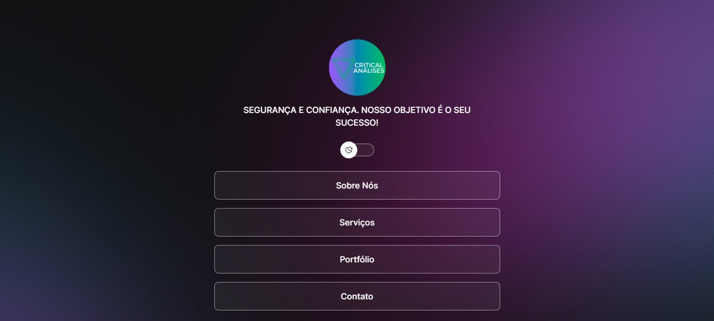

<h1 align="center">Critical Análises</h1>

Desenvolvimento de Site Institucional.

|
  <a href="#-tecnologias">Tecnologias</a> |
  <a href="#-projeto">Projeto</a> | 
  <a href="#-layout">Layout</a> | 
  <a href="#memo-licença">Licença</a> | 

  

 

  

## 📖 Tecnologias

Esse projeto fo desenvolvido com  as seguintes tecnologias:

- HTML e CSS3
- JAVASCRIPT
- GIT e GITHUB
- FIGMA
- CANVA (CRIAÇÃO DO LOGO)

## 💻 Projeto

Site Institucional para divulgação dos serviços da Critical Análises.

## 📐 Layout

Você pode visualizar o layout original do projeto através [DESSE LINK](https://www.figma.com/community/file/1187422022288947321). É necessário ter conta no [Figma](https://figma.com) para acessá-lo.
## :memo: Licença

Esse projeto está sob a licença MIT.

---

Desenvolvido por Robson com base no projeto criado pela Rocketseat :wave: [Participe da nossa comunidade!](https://discord.gg/rocketseat)